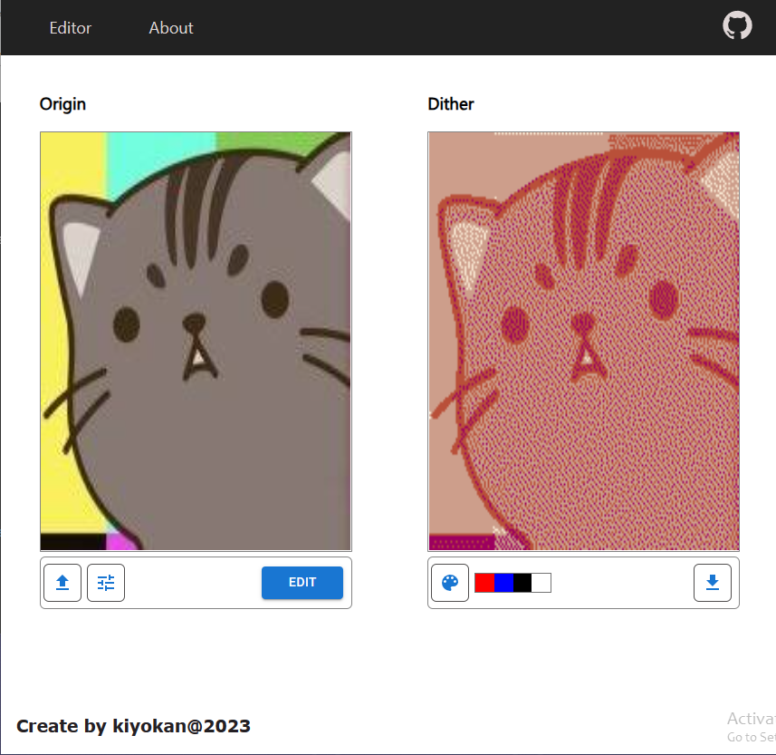

# DitherImageReact

[](https://github.com/DipsisTez)

This open source project was created to enable the reproduction of the filter overlay function in web, using standard web technologies like React, CSS (SCSS), and TS.

## Notice

> This product is my own development created on creative initiative.
> This is not a commercial product.    


## _This project is still a work in progress._




# Features

- [x] Interactive interface
- [x] Modular development
- [x] Ability to navigate
- [x] Ability to change the color palette

# Stack

- Framework - React (^18.2.0) + router-dom
- Use typescript

## FAQ

- How do I install the project?
  - Open a terminal in the root directory and enter the following commands.
  - ```npm install```
  - ```npm build```
- How to run or test a project?
  - ```npm run start```
  - Alternatively, you can write ```npm install --global serve``` after ```serve build```.

<br><br>

<h1 align="center">💫 About Me:</h1>

<p align="center">
  👋 Hello! I’m a seasoned developer specializing in web development. I craft various websites using modern technologies and approaches. I’m passionate about creating exceptional digital experiences that are both visually appealing and functional. I’ve worked on a multitude of projects, ranging from building intricate web applications to developing machine learning models. I’m highly organized, detail-oriented, and committed to delivering high-quality work that meets my clients’ needs. With my skills and experience, I’m confident in my ability to tackle any development challenge that comes my way. 💫
</p>

<h2 align="center">🌐 Connect with me:</h2>

<p align="center">
  <a href="#None">
        
  </a>
  <a href="https://t.me/by_kiyokan">
    
  </a>
  <a href="https://kiyokan2005@gmail.com">
  
</a>
</p>

<h2 align="center">🛠️ Tech Stack:</h2>

<p align="center">
  
  
  
  
  
  
  
  
  
  
  
  
  
  
  
  
  
  
  
  


</p>

<h2 align="center">📊 GitHub Stats:</h2>

<p align="center">
  
  <br/>
  <br/>
  
  <br/>
  <br/>
  
  <br/>
  <br/>
  
  <br/>
  <br/>
  
  <br/>
  <br/>
  
  <br/>
  <br/>
  
  <br/>
  <br/>
  
  <br/>
  <br/>
</p>

<h2 align="center">🏆 GitHub Trophies</h2>

<p align="center">
  
</p>


<p align="center">
    
</p>


